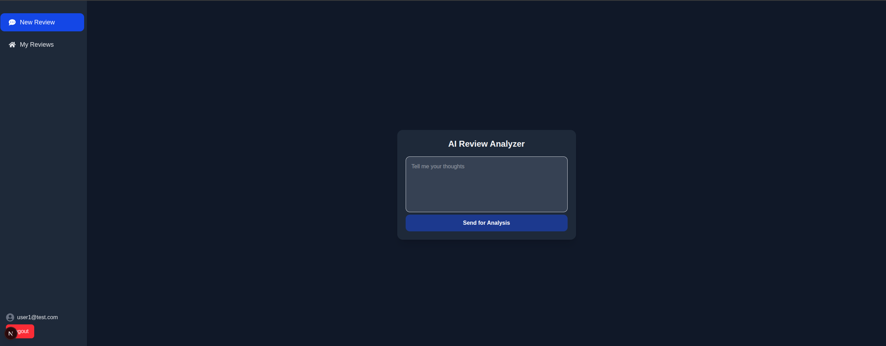
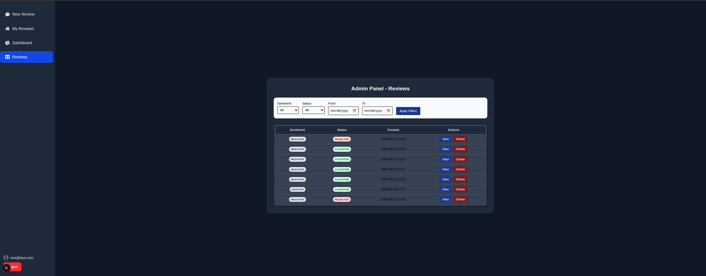
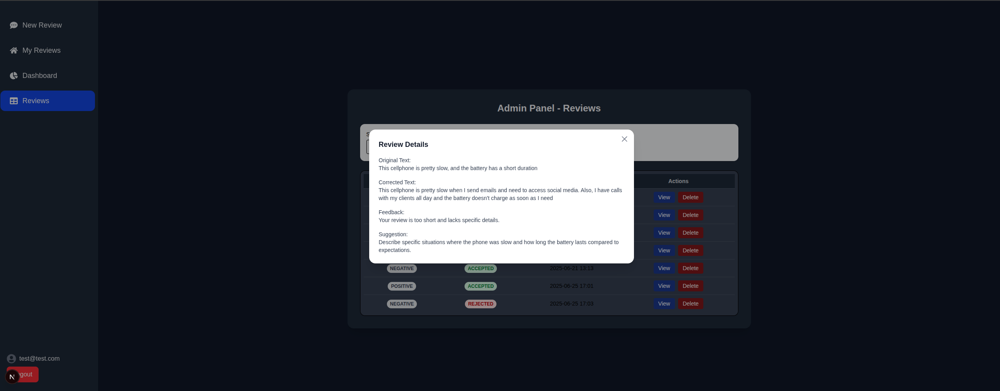

# 🧠 Review Analyzer


**Review Analyzer** is a fullstack AI-powered application that evaluates product reviews in real time. It uses sentiment analysis to detect tone and leverages a Large Language Model (LLM) to assess review quality and provide improvement suggestions when needed.

---

## 🚀 Features

- ✅ Sentiment classification using `distilbert-base-uncased-finetuned-sst-2-english`
- ✅ Review quality evaluation with `microsoft/phi-4`
- ✅ LLM-generated suggestions to help improve poor reviews
- ✅ Frontend built with Next.js and React Query
- ✅ Full backend powered by FastAPI
- ✅ Unit, integration and (soon) E2E testing with pytest and Playwright
- ✅ Secure API proxy to hide AI keys from frontend

---

## 🧰 Tech Stack

- **Frontend:** Next.js, TypeScript, React Query, TailwindCSS
- **Backend:** FastAPI, Hugging Face Transformers, Python
- **LLM:** Hugging Face Inference API (`phi-4`)
- **Sentiment Model:** `distilbert-base-uncased-finetuned-sst-2-english`
- **Testing:** pytest, Playwright
- **Infra:** Render, Vercel

---

## 📸 Demo


<p align="center"><em>Login page</em></p>


<p align="center"><em>Review Analyzer</em></p>


<p align="center"><em>Review Analyzer Submit button</em></p>


<p align="center"><em>My Reviews</em></p>


<p align="center"><em>Dashboard</em></p>


<p align="center"><em>Review List (Admin)</em></p>


<p align="center"><em>Review Details</em></p>

---

## 🛠️ Running Locally

### 1. Clone the project

```bash
git clone https://github.com/seu-usuario/review-analyzer.git
cd review-analyzer
```

### 2. Setup the backend

```bash
cd backend
python -m venv .env
source .env/bin/activate
pip install -r requirements.txt
uvicorn app.main:app --reload
```

> Set your Hugging Face token in `.env` as `HF_TOKEN=...`

### 3. Setup the frontend

```bash
cd frontend
npm install
npm run dev
```

> Ensure `.env.local` has:
> `API_URL=http://localhost:8000`
> `NEXTAUTH_URL=http://localhost:3000`
> `NEXTAUTH_SECRET=your-secret`
> `GOOGLE_CLIENT_ID=your-google-client`
> `GOOGLE_CLIENT_SECRET=your-client-secret`

---

## 🧪 Running Tests

```bash
# Unit & Integration (backend)
cd backend
PYTHONPATH=. pytest

# E2E (frontend)
cd frontend
npx playwright test
```

---

## 📁 Project Structure

```
review-analyzer/
├── backend/
|   |── alembic
│   ├── app/
|   |   |── api/                   # API Endpoints
│   │   ├── core/                  # API clients (Hugging Face)
|   |   |── models/                # Models
│   │   ├── services/              # Business logic: LLM + Sentiment
│   │   ├── utils/                 # Prompt formatters, extractors
|   |   |── database.py            # Database Configuration
|   |   |── dependencies.py        # Get Current User
│   │   ├── schemas.py             # Pydantic models
|   |   |── security.py            # Token/Password management
│   │   └── main.py                # FastAPI entrypoint
│   ├── tests/
│   │   ├── unit/                  # Unit tests (mocked services)
│   │   ├── integration/           # Integration tests (API endpoints)
│   │   └── conftest.py            # Test fixtures
│   └── requirements.txt
│
├── frontend/
|   |── src/app                    # Next.js pages (App Router)
│   │   |── admin                  # Admin Page
|   |   |── api                    # Proxy to backend
|   │   ├── review/components/     # ReviewForm, ReviewFilter, etc.
|   │   ├── lib/                   # reviewService (fetch wrapper)
|   │   ├── public/                # Static assets (logo, etc.)
|   |   |── login/                 # Login Page
│   |── tests/
|   |   └── e2e/                   # Playwright tests
├── README.md
├── .env.example
└── .gitignore
```

---

## 🔮 Roadmap

- [x] ⚙️ Continuous Integration (CI) with Github Actions
- [x] 🧪 End-to-end tests with Playwright
- [x] ✍️ Feedback loop for rejected reviews
- [x] 📊 Admin dashboard with filters and stats
- [x] 🔐 User authentication (credentials & Google OAuth)
- [x] 📝 Review linked to user (user-specific review history)
- [x] 📊 Admin statistics by sentiment, status, etc.
- [x] 🗃️ User “My Reviews” page (/my-reviews)
- [x] 🚀 Public demo deployment


---

## 📄 License

MIT © Rafael Aquino — 2025