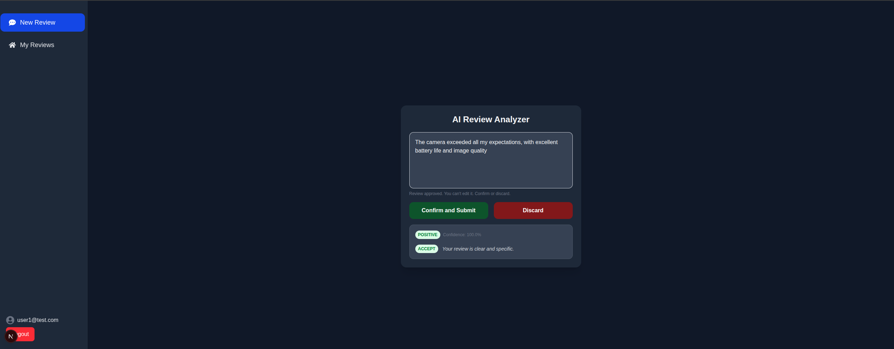
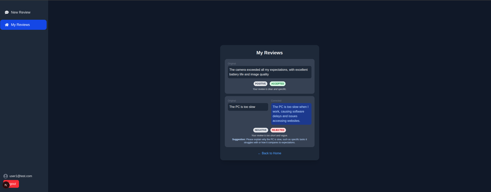
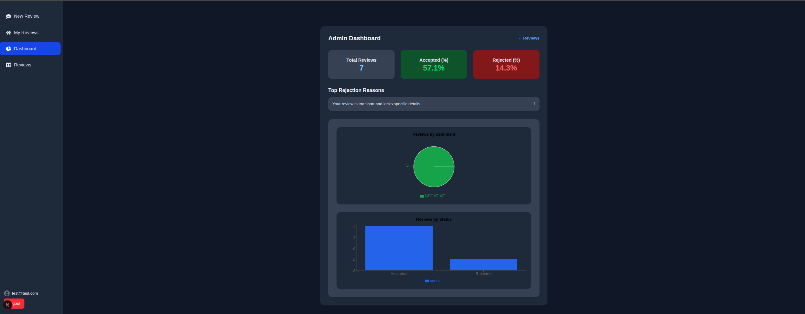

# 🧠 Review Analyzer


**Review Analyzer** is a fullstack AI-powered application that evaluates product reviews in real time. It uses sentiment analysis to detect tone and leverages a Large Language Model (LLM) to assess review quality and provide improvement suggestions when needed.

---

## 🚀 Features

- ✅ Sentiment classification using `distilbert-base-uncased-finetuned-sst-2-english`
- ✅ Review quality evaluation with `microsoft/phi-4`
- ✅ LLM-generated suggestions to help improve poor reviews
- ✅ Frontend built with Next.js and React Query
- ✅ Full backend powered by FastAPI
- ✅ Unit, integration and (soon) E2E testing with pytest and Playwright
- ✅ Secure API proxy to hide AI keys from frontend
- ✅ Retrieval-Augmented Generation (RAG) com `pgvector` para buscar reviews similares e enriquecer as respostas da LLM


---

## 🧰 Tech Stack

- **Frontend:** Next.js, TypeScript, React Query, TailwindCSS
- **Backend:** FastAPI, Hugging Face Transformers, Python, pgvector (Postgres)
- **LLM:** Hugging Face Inference API (`phi-4`)
- **Sentiment Model:** `distilbert-base-uncased-finetuned-sst-2-english`
- **Testing:** pytest, Playwright
- **Infra:** Render, Vercel

---

## 🧩 Retrieval-Augmented Generation (RAG)

The Review Analyzer now supports RAG (Retrieval-Augmented Generation) to enhance the review analysis process.

1. Converts the new review into an embedding vector
2. Searches in the database (Postgres + pgvector) for semantically similar reviews.
3. Provides these reviews as additional context to the LLM.

This approach increases relevance, consistency, and accuracy of the responses, avoiding generic answers.

---

## 📸 Demo


<p align="center"><em>Login page</em></p>


<p align="center"><em>Review Analyzer</em></p>


<p align="center"><em>Review Analyzer Submit button</em></p>


<p align="center"><em>My Reviews</em></p>


<p align="center"><em>Dashboard</em></p>


<p align="center"><em>Review List (Admin)</em></p>


<p align="center"><em>Review Details</em></p>

---

## 🛠️ Running Locally

### 1. Clone the project

```bash
git clone https://github.com/seu-usuario/review-analyzer.git
cd review-analyzer
```

### 2. Setup the backend

```bash
cd backend
python -m venv .env
source .env/bin/activate
pip install -r requirements.txt
uvicorn app.main:app --reload
```

> Set your Hugging Face token in `.env` as `HF_TOKEN=...`

### 3. Setup the frontend

```bash
cd frontend
npm install
npm run dev
```

> Ensure `.env.local` has:
> `API_URL=http://localhost:8000`
> `NEXTAUTH_URL=http://localhost:3000`
> `NEXTAUTH_SECRET=your-secret`
> `GOOGLE_CLIENT_ID=your-google-client`
> `GOOGLE_CLIENT_SECRET=your-client-secret`

---

## 🧪 Running Tests

```bash
# Unit & Integration (backend)
cd backend
PYTHONPATH=. pytest

# E2E (frontend)
cd frontend
npx playwright test
```

---

## 📁 Project Structure

```
review-analyzer/
├── backend/
│   ├── alembic/                         # Alembic migrations
│   │   ├── env.py                       # Alembic runtime config (SQLModel/SQLAlchemy)
│   │   ├── script.py.mako               # Migration template
│   │   └── versions/                    # Migration files (e.g., *_init.py)
│   ├── alembic.ini                      # Alembic config (points to DB URL/env.py)
│   ├── app/
│   │   ├── main.py                      # FastAPI app + routers include
│   │   ├── database.py                  # Engine/Session factory + get_session
│   │   ├── security.py                  # JWT helpers (create/verify), password hashing
│   │   ├── dependencies.py              # Auth guard: get_current_user
│   │   ├── schemas.py                   # Pydantic DTOs (Review*, Auth*, Rag*)
│   │   ├── models/                      # SQLModel tables
│   │   │   ├── user.py
│   │   │   └── review.py
│   │   ├── api/
│   │   │   └── v1/
│   │   │       ├── deps.py              # DI factories (use cases, repos, embedders)
│   │   │       └── endpoints/
│   │   │           ├── auth.py          # Thin endpoints → delegate to Auth UCs
│   │   │           ├── review.py        # /analyze_review, /reviews, /mine
│   │   │           ├── admin.py         # /admin/reviews, /admin/stats, delete
│   │   │           └── rag.py           # /rag/search
│   │   ├── domain/                      # Business/Application core (Hexagonal)
│   │   │   ├── auth/
│   │   │   │   ├── entities.py
│   │   │   │   ├── interfaces.py
│   │   │   │   └── use_cases.py         # RegisterUser, LoginUser, GoogleLogin, TokenExchange, RefreshTokens
│   │   │   ├── reviews/
│   │   │   │   ├── entities.py
│   │   │   │   ├── exceptions.py
│   │   │   │   ├── interfaces.py        # ReviewRepository, Sentiment, Suggestion, Embedder
│   │   │   │   └── use_cases.py         # EvaluateText, ListMyReviews, SaveApprovedReview (embeds & saves)
│   │   │   ├── rag/
│   │   │   │   ├── entities.py          # RagHit
│   │   │   │   ├── interfaces.py        # RagRepository, Embedder
│   │   │   │   └── use_cases.py         # SearchRag
│   │   │   └── admin/
│   │   │       ├── entities.py          # AdminStats, Period, RejectionReason
│   │   │       ├── interfaces.py        # AdminReviewsRepository (ports)
│   │   │       └── use_cases.py         # ListReviews, DeleteReview, GetStats
│   │   ├── infra/                       # Adapters (Hexagonal)
│   │   │   ├── db/
│   │   │   │   ├── repositories.py      # User repository (SQLModel)
│   │   │   │   ├── reviews_repository.py# Reviews CRUD (+ embedding save)
│   │   │   │   ├── rag_repository.py    # Vector search (pgvector) for RAG
│   │   │   │   └── admin_repository.py  # Admin filters/aggregations (list/delete/stats)
│   │   │   ├── embeddings/
│   │   │   │   └── local_sentence_transformer.py  # E5 embedder (query/doc) with cache/device
│   │   │   └── tokens/
│   │   │       └── token_provider.py    # Token provider for Auth UCs
│   │   ├── services/
│   │   │   ├── retriever.py
│   │   │   ├── sentiment_analysis_service.py
│   │   │   └── suggestion_service.py
│   ├── tests/
│   │   ├── unit/                        # Unit tests (use cases, services)
│   │   ├── integration/                 # Integration tests (API endpoints/repos)
│   │   └── conftest.py                  # Test fixtures (DB, DI overrides, fake embedders)
│   ├── pyproject.toml                   # uv/packaging config (deps, extras)
│   └── uv.lock                          # lockfile
│
├── frontend/
|   |── src/app                    # Next.js pages (App Router)
│   │   |── admin                  # Admin Page
|   |   |── api                    # Proxy to backend
|   │   ├── review/components/     # ReviewForm, ReviewFilter, etc.
|   │   ├── lib/                   # reviewService (fetch wrapper)
|   │   ├── public/                # Static assets (logo, etc.)
|   |   |── login/                 # Login Page
│   |── tests/
|   |   └── e2e/                   # Playwright tests
├── README.md
├── .env.example
└── .gitignore
```

---

## 🔮 Roadmap

- [x] ⚙️ Continuous Integration (CI) with Github Actions
- [x] 🧪 End-to-end tests with Playwright
- [x] ✍️ Feedback loop for rejected reviews
- [x] 📊 Admin dashboard with filters and stats
- [x] 🔐 User authentication (credentials & Google OAuth)
- [x] 📝 Review linked to user (user-specific review history)
- [x] 📊 Admin statistics by sentiment, status, etc.
- [x] 🗃️ User “My Reviews” page (/my-reviews)
- [x] 🧩 RAG integration (pgvector + LLM)
- [x] 🚀 Public demo deployment


---

## 📄 License

MIT © Rafael Aquino — 2025